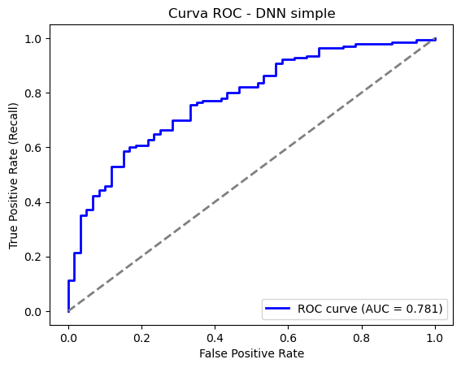
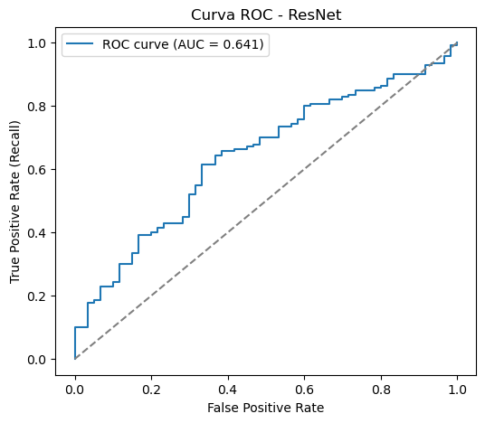

# 🧠 Proyecto 1 — Sistema Inteligente de Scoring Crediticio (DNN)

> **Tema:** Redes Neuronales Profundas aplicadas a riesgo crediticio

---

## 🎯 Objetivo
Diseñar, entrenar y evaluar un modelo de red neuronal profunda (DNN) para predecir la probabilidad de impago de clientes bancarios, utilizando un conjunto de datos realista.  
El modelo debe ser explicable, eficiente y presentar resultados interpretables para su uso en contextos financieros.

---

## 🧩 Contexto
Las entidades financieras deben decidir si otorgan o no un crédito a un cliente.  
Si la decisión se basa en modelos poco explicables, puede generar sesgos, exclusiones injustas o pérdidas económicas.  

Este proyecto busca construir un modelo **moderno, preciso y explicable**, basado en **redes neuronales profundas (DNN)**, que permita mejorar la calidad de las decisiones crediticias.

---

## 📊 Resumen del Proyecto
- Se realizó un **análisis exploratorio de datos (EDA)** para identificar patrones de buen/mal pagador.  
- Se aplicó **preprocesamiento** y balanceo de clases con **SMOTE**.  
- Se entrenaron dos modelos principales:
  - 🧠 **DNN simple** → Accuracy: 70.5%, AUC: 0.78  
  - ⚙️ **ResNet tabular** → Accuracy: 64%, AUC: 0.64  

📈 La **DNN simple** mostró mejor generalización y equilibrio, siendo la opción más confiable.

---

## 🧰 Tecnologías Utilizadas
- Python  
- TensorFlow / Keras  
- Scikit-learn  
- Pandas / NumPy  
- Matplotlib / Seaborn  
- SMOTE (imbalanced-learn)

---

## 📂 Estructura de Archivos

```bash
 proyecto1/                 ← Carpeta del Proyecto 1
   ├─ 📜 README.md              ← Documentación detallada del proyecto 1
   ├─ 📂 data/                  ← (Opcional) datasets utilizados
   ├─ 📔 notebooks/             ← Notebooks de análisis y entrenamiento
   ├─ 📂 scripts/               ← Scripts Python (.py) de entrenamiento, preprocesamiento, etc.
   ├─ 📂 reports/               ← Gráficos, visualizaciones, resultados
   └─ 📜 requirements.txt       ← Dependencias del proyecto
```
--- 

## > Resultados Principales/Hallazgos

Se desarrolló un sistema de scoring crediticio basado en redes neuronales profundas para predecir la probabilidad de impago de clientes bancarios, comenzando con un análisis exploratorio que identificó diferencias entre buenos y malos pagadores, especialmente en monto y duración del crédito. Tras preprocesar los datos y aplicar SMOTE para balancear clases, se entrenaron dos modelos: una DNN simple y una ResNet tabular. 

<p align="center">
  
  
</p>

<div align="center">
  
| Métricas  | Modelo DNN Simple | ResNet |
|-----------|-----------|-----------    |
| `Accuracy`|  0.705    |  0.640        |
|   `AUC`   |   0.780   |  0.640        |

</div>

Tal como se ve en las Curvas ROC, la DNN simple mostró un desempeño superior, con accuracy de 70,5% y AUC de 0,78, generalizando bien y equilibrando la predicción entre clientes “good” y “bad”. En cambio, la ResNet obtuvo accuracy de 64% y AUC de 0,64, clasificando mejor a clientes “bad” pero con un riesgo elevado de falsos positivos. En conclusión, la DNN simple se posiciona como la opción más confiable y efectiva para decisiones de crédito, aunque aún puede mejorarse la predicción de clientes solventes y la interpretabilidad del modelo.

## > 📄 Conclusiones

>El sistema de scoring crediticio basado en redes neuronales profundas comparó una DNN simple y una ResNet tabular.
>
>La DNN obtuvo mejor desempeño (Accuracy ≈ 70%, AUC ≈ 0.78), mostrando buena capacidad de generalización y discriminación entre clientes buenos y >malos, mientras que la ResNet fue menos precisa (Accuracy ≈ 64%, AUC ≈ 0.64) y generó más falsos positivos, lo que implica mayor riesgo financiero.
>
>Aunque la DNN es el modelo más confiable, presenta sesgo hacia la clase “Bad” y baja precisión en clientes “Good” (43%).
>Se recomienda optimizar hiperparámetros, mejorar embeddings, ajustar el umbral de decisión y aplicar técnicas de interpretabilidad (SHAP, LIME) >para garantizar transparencia y confiabilidad.

