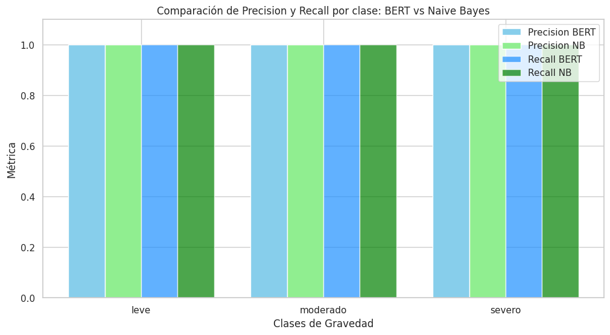
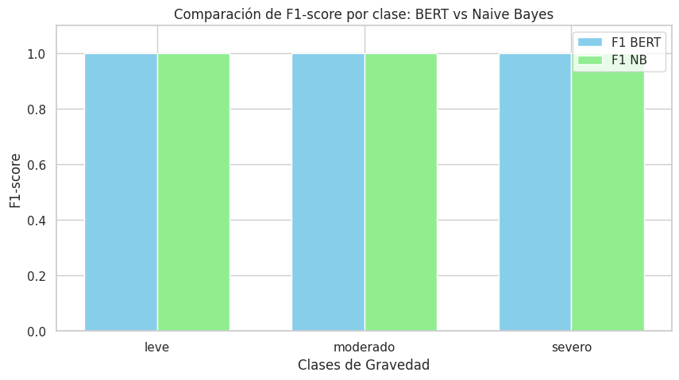

# 🏥 Proyecto 2 — Clasificación de Notas Clínicas con Enfoque Ético y Mitigación de Sesgos

> ### Procesamiento de Lenguaje Natural (NLP) aplicado al ámbito clínico

---

## 🎯 Objetivo
Desarrollar un sistema de **NLP** que clasifique textos médicos según su **gravedad clínica (leve, moderado, severo)**, aplicando buenas prácticas de **preprocesamiento, evaluación y mitigación de sesgos** lingüísticos y sociales.  
El modelo debe ser **transparente, explicable y éticamente responsable**.

---

## 🧩 Contexto
Los registros médicos en texto libre contienen información valiosa, pero requieren tiempo y conocimiento médico para ser interpretados correctamente.  
El proyecto propone un **sistema automatizado** que ayuda a la **detección temprana de afecciones**, priorizando pacientes y reduciendo riesgos.

Se incluyen análisis de **posibles sesgos lingüísticos o sociales** y uso de **técnicas de interpretabilidad (LIME)** para garantizar confianza y ética.

---

## 📊 Resumen del Proyecto
Se compararon dos enfoques:

- 📚 **Naive Bayes + TF-IDF**  
- 🤖 **BERT Multilingual / BETO**

Ambos lograron **métricas perfectas en validación**, mostrando gran capacidad predictiva pero con riesgo de **sobreajuste**.  
Se aplicaron técnicas de **interpretabilidad (LIME)** y evaluación ética sobre posibles sesgos en el lenguaje clínico.

📈 El proyecto demuestra que los sistemas de NLP pueden aplicarse de manera **efectiva y responsable** en contextos clínicos.

---

## 🧰 Tecnologías Utilizadas
- Python  
- Scikit-learn  
- Transformers (Hugging Face)  
- BERT Multilingual / BETO  
- LIME  
- NLTK / spaCy  
- Pandas / NumPy

---

## 📂 Estructura de Archivos

```bash
 proyecto2/                 ← Carpeta del Proyecto 2
   ├─ 📜 README.md
   ├─ 📂 data/
   ├─ 📔 notebooks/
   ├─ 📂 scripts/
   ├─ 📂 reports/
   └─ 📜 requirements.txt
```
--- 

## 📈 Resultados Principales/Hallazgos

Se implementaron y compararon dos enfoques: Naive Bayes con TF-IDF y BERT en español, ambos entrenados en un dataset de notas clínicas. Los modelos alcanzaron métricas perfectas en el conjunto de validación, lo que evidenció tanto la capacidad de separación de los datos como el riesgo de sobreajuste. Para garantizar transparencia, se aplicaron métodos de interpretabilidad como LIME, y se evaluaron los riesgos éticos y sesgos potenciales.

<p align="center">
  
  
</p>

<div align="center">

### Bayes Naives
  
| Gravedad Clínica | `accuracy`  | `precision` | `recall` | `F1-Score` |
|-----------|-----------|-----------|-----------|-----------|
| Leve| 1.00 | 1.00 | 1.00 | 1.00 |
| Moderado | 1.00 | 1.00 | 1.00 | 1.00 |
| Grave | 1.00 | 1.00 | 1.00 | 1.00 |

</div>

<div align="center">

### BERT
 
| Gravedad Clínica | `accuracy`  | `precision` | `recall` | `F1-Score` |
|-----------|-----------|-----------|-----------|-----------|
| Leve| 1.00 | 1.00 | 1.00 | 1.00 |
| Moderado | 1.00 | 1.00 | 1.00 | 1.00 |
| Grave | 1.00 | 1.00 | 1.00 | 1.00 |

</div>


Tanto Naive Bayes como BERT alcanzaron un rendimiento perfecto (100% en precisión, recall, F1 y accuracy), lo que sugiere que el dataset es pequeño y fácilmente separable, con posible sobreajuste. No se observa ventaja entre ambos modelos: Naive Bayes es más rápido y eficiente para tareas simples, mientras que BERT ofrece mayor robustez para escenarios más complejos o con mayor volumen de datos.


## 📄 Conclusiones

El sistema de scoring crediticio basado en redes neuronales profundas comparó una DNN simple y una ResNet tabular.

La DNN obtuvo mejor desempeño (Accuracy ≈ 70%, AUC ≈ 0.78), mostrando buena capacidad de generalización y discriminación entre clientes buenos y malos, mientras que la ResNet fue menos precisa (Accuracy ≈ 64%, AUC ≈ 0.64) y generó más falsos positivos, lo que implica mayor riesgo financiero.

Aunque la DNN es el modelo más confiable, presenta sesgo hacia la clase “Bad” y baja precisión en clientes “Good” (43%).
Se recomienda optimizar hiperparámetros, mejorar embeddings, ajustar el umbral de decisión y aplicar técnicas de interpretabilidad (SHAP, LIME) para garantizar transparencia y confiabilidad.


#### 🔗 [Ver análisis completo en el Notebook (.ipynb) »](./notebooks/SISC_DNN.ipynb)
