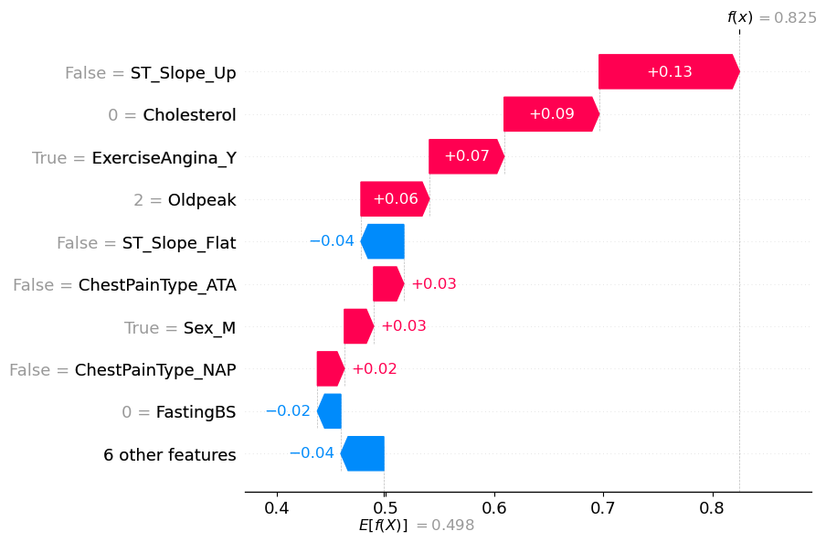
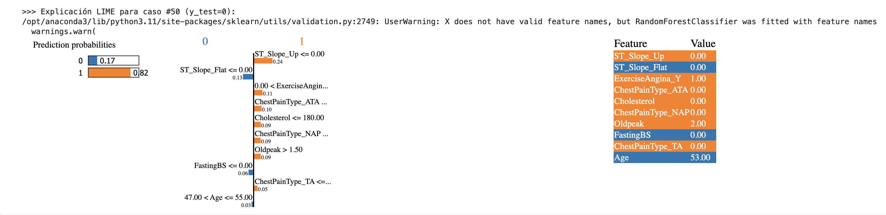

# 🔍 Proyecto 3 — Interpretabilidad de Modelos Predictivos usando LIME y SHAP

> ### Explicabilidad y ética en inteligencia artificial

---

## 🎯 Objetivo
Aplicar herramientas de **explicabilidad de modelos**, como **LIME** y **SHAP**, para analizar y justificar el comportamiento de un modelo de clasificación, destacando la importancia de la **transparencia y ética** en IA.

---

## 🧩 Contexto
Formar parte de un equipo que usa **IA en decisiones críticas** implica construir modelos **explicables y auditables**.  
Este proyecto muestra cómo la interpretabilidad permite **detectar errores y sesgos ocultos** y mejorar la confianza en las decisiones automatizadas.

---

## 📊 Resumen del Proyecto
Se analizó un modelo de **Random Forest** para predecir **enfermedades cardíacas**, utilizando **LIME** y **SHAP**:

- Precisión general: **88.6%**  
- Uso correcto de variables relevantes: **ECG, angina, frecuencia cardíaca máxima**  
- Problema detectado: valores de **colesterol mal interpretados** (`0.0`), causando falsos positivos

📈 El proyecto demuestra que **precisión sin interpretabilidad** no es suficiente, y que la transparencia es esencial en IA crítica.

---

## 🧰 Tecnologías Utilizadas
- Python  
- Scikit-learn  
- Random Forest  
- LIME  
- SHAP  
- Matplotlib / Seaborn  
- Pandas / NumPy

---

## 📂 Estructura de Archivos

```bash
 proyecto3/               
   ├─ 📜 README.md              ← Carpeta del Proyecto 3
   ├─ 📂 data/                 
   ├─ 📔 notebooks/             
   ├─ 📂 scripts/               
   ├─ 📂 reports/              
   └─ 📜 requirements.txt       
  ```
--- 

## 📈 Resultados Principales/Hallazgos

El análisis de un modelo de Random Forest para predecir enfermedades cardíacas presentó el siguiente resultado:

<p align="center">
  
  
</p>

<h3 align="center">Modelo Random Forest entrenado</h3>
<h4 align="center">Métricas en entrenamiento: <b>accuracy: 1.00</b></h4>

<table align="center">
  <thead>
    <tr>
      <th>Clase del paciente</th>
      <th>Precisión</th>
      <th>Recall</th>
      <th>F1-Score</th>
    </tr>
  </thead>
  <tbody>
    <tr>
      <td>Sano (0)</td>
      <td align="right">1.00</td>
      <td align="right">1.00</td>
      <td align="right">1.00</td>
    </tr>
    <tr>
      <td>Enfermo (1)</td>
      <td align="right">1.00</td>
      <td align="right">1.00</td>
      <td align="right">1.00</td>
    </tr>
  </tbody>
</table>

<h3 align="center">Modelo Random Forest entrenado</h3>
<h4 align="center">Métricas en prueba: <b>accuracy: 0.89</b></h4>

<table align="center">
  <thead>
    <tr>
      <th>Clase del paciente</th>
      <th>Precisión</th>
      <th>Recall</th>
      <th>F1-Score</th>
    </tr>
  </thead>
  <tbody>
    <tr>
      <td>Sano (0)</td>
      <td align="right">0.89</td>
      <td align="right">0.85</td>
      <td align="right">0.87</td>
    </tr>
    <tr>
      <td>Enfermo (1)</td>
      <td align="right">0.89</td>
      <td align="right">0.91</td>
      <td align="right">0.90</td>
    </tr>
  </tbody>
</table>

y arrojó la siguiente matriz de confusión:

<h3 align="center">🔹 Matriz de confusión — Modelo Random Forest</h3>

<table align="center">
  <thead>
    <tr>
      <th>Real \ Predicción</th>
      <th>0 (Sano)</th>
      <th>1 (Enfermo)</th>
    </tr>
  </thead>
  <tbody>
    <tr>
      <td><b>0 (Sano)</b></td>
      <td align="center">0.705</td>
      <td align="center">0.640</td>
    </tr>
    <tr>
      <td><b>1 (Enfermo)</b></td>
      <td align="center">0.780</td>
      <td align="center">0.640</td>
    </tr>
  </tbody>
</table>

Se tuvo que, el modelo Random Forest mostró un excelente desempeño, con un accuracy del 89% en prueba, aunque evidenció sobreajuste por su rendimiento perfecto en entrenamiento (100%). Detectó eficazmente a los pacientes con enfermedad (recall = 0.91), pero aún cometió algunos errores: 12 falsos positivos y 9 falsos negativos, siendo estos últimos clínicamente más críticos. En general, el modelo generalizó bien, pero requiere ajuste de hiperparámetros para reducir el sobreajuste y mejorar la detección de casos verdaderamente enfermos.

Con las siguientes herramientas de interpretabilidad se reveló que, aunque el modelo tiene una alta precisión general (88.6%), su lógica interna es defectuosa y potencialmente peligrosa.

### Uso de herramientas de interpretabilidad: SHAP

### Explicabilidad de un caso (paciente) que el modelo predijo que padecía de una enfermedad cardíaca pero que en realidad estaba sano

<div align="center">
  <H3> SHAP </H3>
</div>
<p align="center">
  
</p>

El modelo predijo un 83% de probabilidad de enfermedad cardíaca para el paciente 50, aunque en realidad estaba sano (falso positivo). La predicción se vio influenciada principalmente por la ausencia de elevación del segmento ST, un valor anómalo de colesterol = 0, y la presencia de angina durante el ejercicio, factores que el modelo interpretó como señales de alto riesgo. Esto evidenció que el modelo era sensible a datos erróneos y podía generar predicciones incorrectas cuando existían valores atípicos o inconsistentes, destacando la necesidad de mejorar la calidad de los datos y ajustar la interpretación de variables críticas.

### Uso de herramientas de interpretabilidad: LIME

<div align="center">
  <H3> LIME </H3>
</div>
<p align="center">
  
</p>

El modelo predijo erróneamente un 82% de probabilidad de enfermedad cardíaca para el paciente 50, quien en realidad estaba sano (falso positivo). Factores como la ausencia de elevación del segmento ST, la presencia de angina durante el ejercicio y un valor anómalo de colesterol = 0 influyeron decisivamente en la predicción. El análisis LIME evidenció que el modelo malinterpretó variables clínicas y valores anómalos, lo que destacó la necesidad de mejorar la calidad de los datos y ajustar la interpretación de factores críticos para evitar errores similares en el futuro.

### Comparativa entre LIME Y SHAP en base a los resultados obtenidos

Tanto SHAP como LIME proporcionaron interpretabilidad del modelo, pero con enfoques distintos. Ambos explican predicciones individuales, identifican las variables más influyentes (como ECG y angina) y presentan visualizaciones claras.

Diferencias clave:
	•	SHAP ofrece explicaciones locales y globales, es teóricamente consistente (valores de Shapley) y permite detectar patrones y contradicciones en todo el modelo.
	•	LIME es estrictamente local, crea modelos simples alrededor de cada caso y depende de los datos cercanos para su precisión, sin ofrecer visión global.

En conclusión, SHAP es más robusto y completo, mientras que LIME es útil para explicaciones rápidas de casos individuales; ambos son complementarios para entender y auditar el modelo.


## 📄 Conclusiones

El modelo Random Forest mostró un alto rendimiento en prueba (accuracy 88.6%), apoyándose en variables clínicamente relevantes como ST_Slope, angina por ejercicio y Oldpeak. Sin embargo, su lógica presentó fallas críticas: fue sensible a datos erróneos (valores anómalos de colesterol) y cometió falsos positivos y negativos, ignorando en algunos casos señales clínicas importantes como angina o MaxHR.

Vimos casos puntuales, como el del paciente X, en donde analizamos la explicabilidad utilizando SHAP y LIME. En este caso, el modelo lo predijo como enfermo, aunque en realidad estaba sano, permitiéndonos identificar un falso positivo y las variables más influyentes que llevaron a esa predicción errónea.

Esto evidencia que alta precisión no garantiza confiabilidad y que la interpretabilidad es esencial para auditar la lógica del modelo, aumentar la confianza de los médicos e identificar sesgos. Para conocer los detalles completos de este análisis y complementarlo con los resultados vistos aquí, se recomienda revisar el notebook .ipynb, donde aparece el análisis detallado.

Considerar que, a futuro, se planeará una mejora del modelo, enfocada en depuración y validación exhaustiva de los datos, optimización de hiperparámetros, y evaluación comparativa con algoritmos como XGBoost o redes neuronales. Además, se implementará un proceso continuo de monitorización y reentrenamiento con nuevos datos clínicos, garantizando un modelo más robusto, confiable y alineado con la medicina basada en evidencia.

#### 🔗 [Ver análisis completo en el Notebook (.ipynb) »](./notebooks/IMP_LIME_y_SHAP.ipynb)
